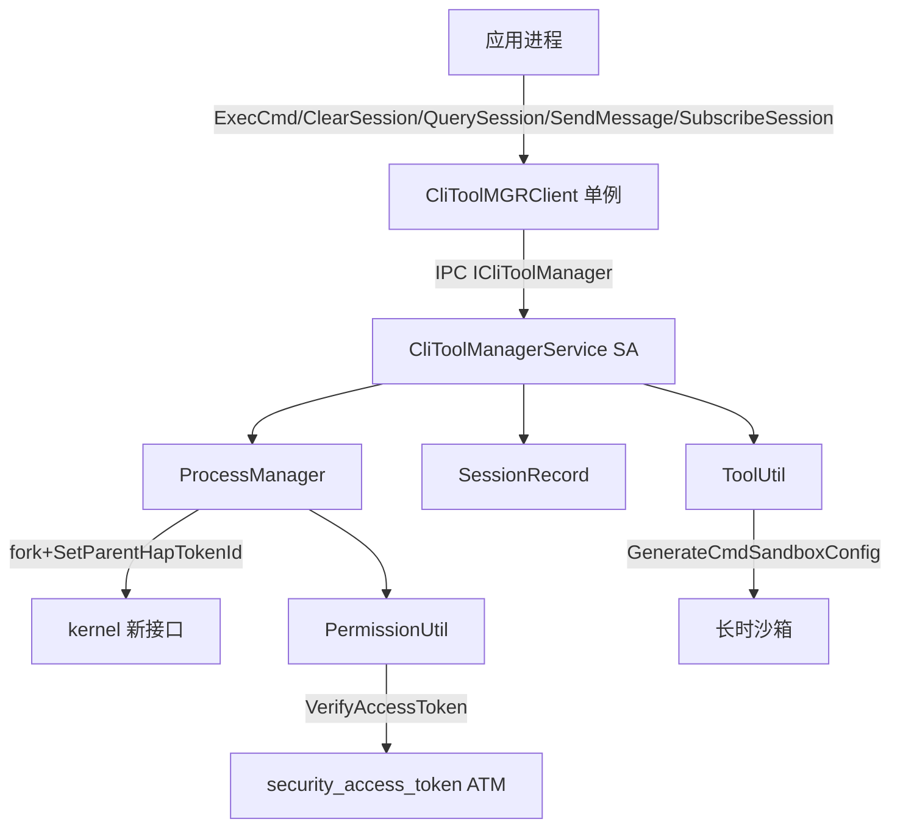
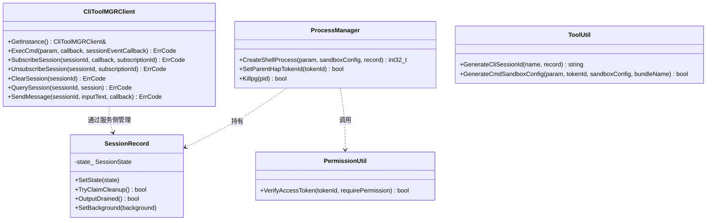
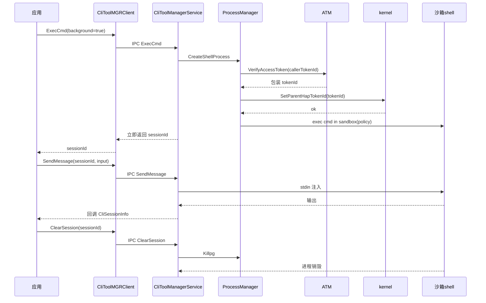

# Design

## 需求基线摘要

需求基线详见 proposal.md。设计阶段需额外强调：本能力跨三仓，security_access_token / kernel 为依赖方，ability_ability_runtime 为代码交付方；session 生命周期与并发清理是核心复杂点。

## 代码事实基线

| 事实项 | 代码引用（文件:行） | 对设计的约束 |
|--------|-------------------|-------------|
| CliToolMGRClient 单例与对外方法 | `cli_tool_framework/interfaces/cli_tool/include/cli_tool_mgr_client.h:50` | 客户端须为单例，ExecCmd/ClearSession/QuerySession/SendMessage/SubscribeSession 为对外契约 |
| ExecCmdParam 含 policy 字段 | `exec_cmd_param.h:34` | policy 透传不解释，由 sandbox 侧消费 |
| ExecOptions.background 区分前后台 | `exec_options.h:32` | 前台/后台用布尔而非双接口 |
| SessionRecord 状态机与 TryClaimCleanup | `cli_tool_framework/services/climgr/include/session_record.h:46` | 并发清理须原子认领，避免重复 kill |
| ProcessManager.SetParentHapTokenId | `cli_tool_framework/services/climgr/include/process_manager.h:59` | fork 后须先 ATM 后内核设置 tokenId |

## 设计约束

1. 客户端为单例，经 IPC 与服务 SA 通信。
2. policy 透传不解释语义。
3. tokenId 设置顺序固定：先 ATM 校验/包装，再内核设置 parentHapTokenId。
4. 输出缓冲上限 64KB，超量截断。

## 非目标

- 静态接口（7.1）。
- JS/NAPI 绑定层。
- security_access_token / kernel 内部实现。

## 方案概述

采用四层分层架构：客户端层（单例 + IPC 代理）↔ IPC 层（ICliToolManager 跨进程契约）↔ 服务层（CliToolManagerService + ProcessManager + SessionRecord + ToolUtil，负责命令执行、进程孵化、session 状态机、sandbox 配置）↔ 权限层（PermissionUtil，ATM token 校验）。选择分层而非单体，是因为命令执行涉及跨进程、进程孵化、状态机与安全链路多个关注点，分层使各层可独立演进与测试；session 用显式状态机建模以处理并发清理竞态。

## 架构图

## 类图

## 模块影响

| 子系统 | 仓库 | 模块/路径 | 影响类型 | 相关设计决策 |
|--------|------|-----------|---------|-------------|
| AppFwk | ability_ability_runtime | `cli_tool_framework/interfaces/cli_tool/include` | 新增接口与数据结构 | 决策 D1/D2 |
| AppFwk | ability_ability_runtime | `cli_tool_framework/services/climgr` | 新增 session 状态机/进程管理/工具 | 决策 D2/D3 |
| AppFwk | ability_ability_runtime | `cli_tool_framework/services/common` | 新增 ATM 权限校验 | 决策 D4 |
| Security | security_access_token | ATM 接口 | 依赖 | 决策 D4 |
| Kernel | kernel | 内核新接口 | 依赖 | 决策 D4 |

## 实现入口

| Entry Point | 代码引用（文件:行） | 当前职责 | 调用方 | 被调用方 | 预期变更 |
|-------------|-------------------|----------|--------|----------|----------|
| CliToolMGRClient::ExecCmd | `cli_tool_mgr_client.h:144` | 执行 shell 命令入口 | 应用/NAPI | ICliToolManager IPC | 新增 |
| CliToolMGRClient::ClearSession | `cli_tool_mgr_client.h:153` | 清理 session | 应用 | ICliToolManager IPC | 新增 |
| ProcessManager::CreateShellProcess | `process_manager.h:46` | fork 沙箱 shell 进程 | CliToolManagerService | SetParentHapTokenId/Kernel | 新增 |
| ProcessManager::SetParentHapTokenId | `process_manager.h:59` | 设置父 hap tokenId | CreateShellProcess | kernel 新接口 | 新增 |
| ToolUtil::GenerateCliSessionId | `tool_util.h:55` | 生成 sessionId | CliToolManagerService | - | 新增 |
| ToolUtil::GenerateCmdSandboxConfig | `tool_util.h:60` | 生成沙箱配置(policy) | CliToolManagerService | - | 新增 |
| PermissionUtil::VerifyAccessToken | `permission_util.h:31` | ATM token 校验 | ProcessManager | ATM | 新增 |

## 关键设计决策

| 决策 ID | 问题 | 推荐方案 | 备选方案 | 选择理由 |
|---------|------|----------|----------|---------|
| D1 | 前台/后台如何区分 | ExecOptions.background 布尔，统一 ExecCmd 入口 | 两个独立接口 ExecCmdForeground/ExecCmdBackground | 降低接口面与序列化复杂度 |
| D2 | session 并发清理竞态 | SessionRecord 状态机 + TryClaimCleanup 原子认领 | 全局锁串行清理 | 原子认领避免重复 kill，状态机显式建模 |
| D3 | 长输出 OOM | 64KB 缓冲上限截断 | 无限缓冲 | 防止交互式长输出耗尽内存 |
| D4 | 安全链路顺序 | fork 后先 ATM VerifyAccessToken 再 SetParentHapTokenId | 仅设 parentHapTokenId | 先校验/包装调用方身份再设父身份，保证沙箱进程身份正确 |

## 状态归属与不变量

- **Ownership**：SessionRecord 由 CliToolManagerService 创建，key=sessionId；清理触发=ClearSession 或进程退出；只读消费者=QuerySession/SubscribeSession；不变量：同一 sessionId 同时只有一个清理 owner（TryClaimCleanup）。
- **Lifecycle**：SPAWNING→RUNNING→COMPLETED/FAILED；CANCELLING 为清理路径；不变量：OutputDrained 为 true 后方可终结；验证=AC-2。
- **Concurrency**：TryClaimCleanup 用 atomic<bool> cleanupStarted_ CAS；stdin/stdout/stderr 管道关闭用 atomic 标记；不变量：管道关闭与进程退出顺序不破坏输出回收。
- **Capacity**：stdoutText_/stderrText_ 各限 MAX_BUFFERED_OUTPUT_BYTES=64KB，TrimBufferedOutput 截断。

## 安全基础检查

### 信任边界交叉分析

| 交互类型 | 边界描述 | 通信双方 | 权限管控机制 | 关联 AC |
|---------|----------|----------|-------------|---------|
| 跨进程 | 应用 ↔ cli SA | 应用进程 / CliToolManagerService | IPC 调用方身份校验 | AC-1/AC-2 |
| 跨安全层级 | 用户态 ↔ 内核态 | fork 子进程 / kernel 新接口 | SetParentHapTokenId 经内核新接口 | AC-1/AC-2 |
| 沙箱内外 | 应用沙箱内 shell / cli SA | sandbox shell / CliToolManagerService | policy 透传给 sandbox；tokenId 链路 | AC-2 |
| 跨服务 | cli SA / ATM | ProcessManager / security_access_token | VerifyAccessToken 复用 ATM 既有机制 | AC-1/AC-2 |

### 基础安全要求检查

| 检查项 | 检查结果 | 说明/措施 |
|--------|----------|-----------|
| 加密算法合规 | N/A | 本变更不引入加密算法 |
| 密钥管理安全 | N/A | 不涉及密钥 |
| 随机数安全 | N/A | sessionId 生成非安全随机用途 |
| 输入验证完备 | ✅ | cmd/policy/workDir 字段边界校验；tokenId 校验 |
| 错误处理安全 | ✅ | 不打印 tokenId 明文；路径脱敏 |
| 配置安全 | ✅ | policy 透传不解释，sandbox 侧消费 |

### 敏感数据处理

本次变更不涉及敏感数据处理（tokenId 为系统内部身份标识，非用户敏感数据；不存储密钥/凭证）。

### 深度威胁分析

本次涉及跨进程、沙箱内外、跨安全层级（用户态↔内核态）与权限/能力申请，触发深度威胁分析，生成独立 `threat-model.md`（见该文件 DFD/STRIDE/合规分析）。

## 时序设计

## 风险与缓解

| 风险 | 可能性 | 影响 | 缓解措施 |
|------|--------|------|----------|
| 跨仓接口未对齐 | 中 | 高 | SE 早期阶段先行对齐 ATM/内核接口 |
| 并发清理竞态 | 中 | 高 | TryClaimCleanup 原子认领 |
| 长输出 OOM | 中 | 中 | 64KB 缓冲截断 |
| tokenId 设置顺序错误 | 低 | 高 | 固定先 ATM 后内核，代码注释约束 |

## 验证思路

| 验证场景 | 方法 | 通过标准 |
|----------|------|----------|
| 前台命令 | demo ExecCmd(background=false) | 回调 status=completed，ExecResult 正确 |
| 后台全链路 | demo ExecCmd(background=true)→Subscribe→Send→Clear | sessionId 立即返回；交互结果正确；Clear 后进程消失 |
| 安全链路 | 内核/ATM 侧验证 | parentHapTokenId 被正确设置 |

> 兼容性验证详见 spec.md 兼容性声明章节。
