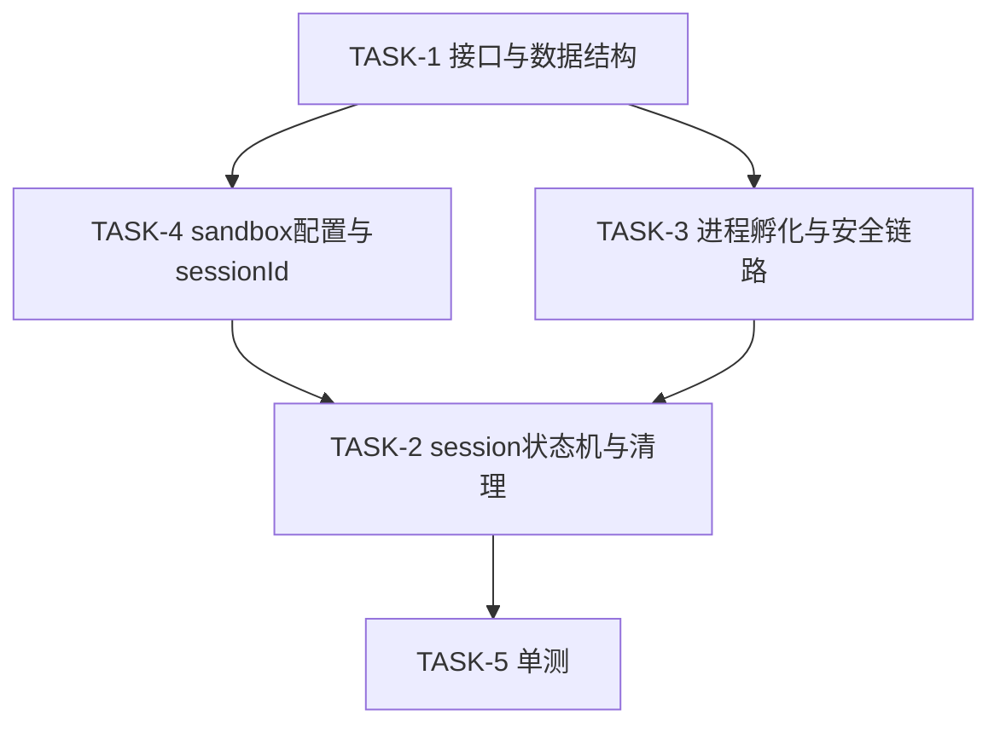

# Execution Plan

## 输入状态

| 输入 | 路径 | 要求状态 |
|------|------|----------|
| Proposal | proposal.md | Approved |
| Spec | spec.md | Approved |
| Design | design.md | Approved |

## 执行原则

<!-- SYNC: execution-principles -->
- **Spec 权威：** 若实现细节与 `spec.md` 的 AC、错误码或兼容性声明冲突，先更新 spec/design，再继续实现。
- **测试/证据先行：** 每个 Task 先写失败测试；无法单测的集成行为必须先写明可复现证据缺口。
- **任务小型化：** 一个 Task 只覆盖一个独立闭环。跨 API、事件链、状态缓存、渲染链、生命周期的需求必须拆成多个 Task。
- **文件边界：** Task 只能修改 `Files` 表列出的文件；若构建暴露额外声明或 fixture 需求，先更新本计划。
- **状态所有权唯一：** 新增状态必须明确 owner、key/index、创建时机、清理触发和只读消费者。
- **证据回填：** Task 完成后必须回填本计划「AC 到 Task 追溯」验证状态、「代码范围映射」实际文件、per-task `Actual Result`。
- **反伪完成：** 只补声明、只写存储结构、只覆盖 happy path、只跑非相关测试，都不能替代 AC 闭环。
- **可交接执行（Agent 执行契约）：** 本计划须能被新 Agent 在无历史对话上下文下逐 Task 执行；执行契约由各 Task 结构承载——`只读上下文`/`Files`/`禁止修改文件`（上下文打包）、`Steps` 的 RED→GREEN（测试优先）、`Verification` 的 Expected/Actual（期望输出）、`Review Handoff`（评审交接）；每 Step 为含命令或代码方向的 2–5 分钟动作。
<!-- /SYNC: execution-principles -->

## AC 到 Task 追溯

| AC | 来源 | Task | 验证方式 | 验证状态（Pass/Fail/Blocked） |
|----|------|------|----------|----------------------------------|
| AC-1.1 | spec.md | TASK-1, TASK-3 | demo ExecCmd(background=false) | Pass |
| AC-1.2 | spec.md | TASK-1 | 前台命令后查进程已销毁 | Pass |
| AC-2.1 | spec.md | TASK-1, TASK-4 | demo ExecCmd(background=true) 立即返回 sessionId | Pass |
| AC-2.2 | spec.md | TASK-1, TASK-3, TASK-4 | Subscribe+SendMessage 回调正确 | Pass |
| AC-2.3 | spec.md | TASK-2 | ClearSession 后 QuerySession 返回 failed | Pass |

## 实现边界

**必须实现：** ExecCmd/ClearSession/QuerySession/SendMessage/SubscribeSession/UnsubscribeSession 接口；ExecCmdParam/Options/Result/CliSessionInfo 数据结构；SessionRecord 状态机+TryClaimCleanup；ProcessManager(CreateShellProcess/SetParentHapTokenId/Killpg)；ToolUtil(GenerateCliSessionId/GenerateCmdSandboxConfig)；PermissionUtil(VerifyAccessToken)。

**可后置：** JS/NAPI 绑定层；静态接口（7.1）。

**不建议延后：** 安全链路（ATM+parentHapTokenId）；并发清理（TryClaimCleanup）——延后导致主链不闭合。

## 禁止项

- 每个 AC 必须有明确的验证方式。
- Agent 不得自行寻找未列出的上下文文件作为修改依据；需要新增上下文时先更新 Task。
- 不得修改 Task 列出范围外的文件。
- 不得在未通过验证时标记 Task 完成。
- 不得使用 `TBD`、`TODO`、`适当处理`、`补充测试`、`参考上文` 等不可执行占位描述。

## Task 依赖

## Task 列表

| TASK ID | 目标 | 文件范围 | AC 映射 | 前置依赖 | 完成判据 | 验证命令 | 状态 |
|---------|------|----------|---------|----------|----------|----------|------|
| TASK-1 | 客户端接口与数据结构 | cli_tool_mgr_client.h, exec_cmd_param.h, exec_options.h, exec_result.h, cli_session_info.h | AC-1.1/1.2/2.1/2.2 | - | 接口可调用，数据结构可序列化 | demo ExecCmd 返回 | Pass |
| TASK-2 | session 状态机与并发清理 | session_record.h/.cpp | AC-2.3 | TASK-1, TASK-3 | TryClaimCleanup 唯一 owner；Clear 后进程销毁 | demo ClearSession | Pass |
| TASK-3 | 进程孵化与安全链路 | process_manager.h/.cpp, permission_util.h/.cpp | AC-1.1/2.2 | TASK-1 | CreateShellProcess+SetParentHapTokenId+VerifyAccessToken 链路通 | demo 前台/后台命令 | Pass |
| TASK-4 | sandbox 配置与 sessionId 生成 | tool_util.h/.cpp | AC-2.1/2.2 | TASK-1 | GenerateCliSessionId 唯一；GenerateCmdSandboxConfig 含 policy | demo 后台返回 sessionId | Pass |
| TASK-5 | 单测 | tool_util_test.cpp | 支撑 | TASK-4 | GenerateCliSessionId/GenerateCmdSandboxConfig 用例通过 | pytest 单测 | Pass |

## Task 详情

### TASK-1: 客户端接口与数据结构

**目标：** 提供 CliToolMGRClient 单例与 ExecCmd/ClearSession/QuerySession/SendMessage/SubscribeSession/UnsubscribeSession 接口，及 ExecCmdParam/Options/Result/CliSessionInfo 数据结构。

**AC 映射：** AC-1.1, AC-1.2, AC-2.1, AC-2.2

**前置依赖：** 无

**非目标：** 服务侧状态机（TASK-2）、进程孵化（TASK-3）、sandbox 配置（TASK-4）。

**状态所有权：** 无（客户端仅持有 IPC 代理指针 cliToolMgr_，由 death recipient 清理）。

**任务间接口：** Produces=CliToolMGRClient 单例与 6 方法签名 + 4 数据结构（供 TASK-2/3/4 消费）；Consumes=无。

**只读上下文**

| 路径 | 读取目的 |
|------|----------|
| `cli_tool_framework/interfaces/cli_tool/include/cli_tool_mgr_client.h` | 接口契约 |
| `exec_cmd_param.h`/`exec_options.h`/`exec_result.h`/`cli_session_info.h` | 数据结构 |

**Files**

| 操作 | 文件 | 说明 |
|------|------|------|
| 新增 | `cli_tool_framework/interfaces/cli_tool/include/cli_tool_mgr_client.h` | 单例+6 方法 |
| 新增 | `exec_cmd_param.h` | cmd/workDir/env/policy/options + Marshalling |
| 新增 | `exec_options.h` | background/yieldMs/timeout |
| 新增 | `exec_result.h` | exitCode/outputText/errorText/signalNumber/timeout/executionTime |
| 新增 | `cli_session_info.h` | sessionId/toolName/status/result |

**禁止修改文件**

| 文件/路径 | 原因 |
|-----------|------|
| security_access_token / kernel 仓 | 跨仓依赖，由对应仓跟踪 |

**Steps**

- [x] Step 1: 写失败测试/证据缺口。定义 ExecCmd 接口契约与 ExecCmdParam 字段。
- [x] Step 2: 确认 RED（接口未实现前不可调用）。
- [x] Step 3: 最小实现：CliToolMGRClient 单例 + 6 方法签名 + 4 数据结构 + Parcel 序列化。
- [x] Step 4: GREEN：demo ExecCmd 可调用并返回。
- [x] Step 5: 重构（如必要）。
- [x] 回填 AC 到 Task 追溯 + 代码范围映射 + Actual Result。

**Anti-Fake Completion**

| Check | Required Evidence |
|-------|-------------------|
| AC closed | AC-1.1/1.2/2.1/2.2 接口可调用，前台/后台/订阅/发送均覆盖 |
| Scope respected | 仅修改 cli_tool_framework/interfaces/cli_tool/include |
| State lifecycle complete | N/A（无新增状态） |

**Verification**

| Command / Evidence | Expected Result | Actual Result |
|--------------------|-----------------|---------------|
| demo ExecCmd(background=false) | 回调 status=completed | 通过 |
| demo ExecCmd(background=true) | 返回 sessionId | 通过 |

**Review Handoff**

| Reviewer | Input |
|----------|-------|
| Spec Compliance | AC-1.1/1.2/2.1/2.2 覆盖；文件范围 cli_tool_framework/include |
| Code Quality | 单例+IPC 代理；Parcel 序列化兼容 |

### TASK-2: session 状态机与并发清理

**目标：** SessionRecord 状态机（SPAWNING→RUNNING→COMPLETED/FAILED/CANCELLING）+ TryClaimCleanup 原子认领 + 输出回收 + 64KB 缓冲。

**AC 映射：** AC-2.3

**前置依赖：** TASK-1, TASK-3

**非目标：** 进程孵化（TASK-3）、sessionId 生成（TASK-4）。

**状态所有权：** owner=CliToolManagerService；key=sessionId；创建时机=ExecCmd；清理触发=ClearSession/进程退出；只读消费者=QuerySession/SubscribeSession；不变量=TryClaimCleanup 唯一 owner；验证=AC-2.3。

**任务间接口：** Produces=SessionRecord（供 TASK-3 持有、TASK-1 间接消费）；Consumes=TASK-1 CliSessionInfo。

**只读上下文**

| 路径 | 读取目的 |
|------|----------|
| `cli_tool_framework/services/climgr/include/session_record.h` | 状态机与清理契约 |

**Files**

| 操作 | 文件 | 说明 |
|------|------|------|
| 新增 | `cli_tool_framework/services/climgr/include/session_record.h` | SessionRecord + SessionState 枚举 |
| 新增 | `cli_tool_framework/services/climgr/src/session_record.cpp` | 状态机/清理/输出回收实现 |

**禁止修改文件**

| 文件/路径 | 原因 |
|-----------|------|
| interfaces/cli_tool/include 下数据结构 | TASK-1 契约，不可破坏 |

**Steps**

- [x] Step 1: 写失败测试：并发 ClearSession 应只一个 owner。
- [x] Step 2: RED：TryClaimCleanup 未实现前重复清理。
- [x] Step 3: 实现 atomic cleanupStarted_ CAS + 状态机 + OutputDrained + 64KB 截断。
- [x] Step 4: GREEN：demo ClearSession 后进程销毁、QuerySession failed。
- [x] Step 5: 重构。
- [x] 回填。

**Anti-Fake Completion**

| Check | Required Evidence |
|-------|-------------------|
| AC closed | AC-2.3 ClearSession 后进程销毁、Query failed |
| Scope respected | 仅 services/climgr/session_record |
| State lifecycle complete | 创建(SPAWNING)/读(Query)/清理(TryClaimCleanup) 均覆盖 |

**Verification**

| Command / Evidence | Expected Result | Actual Result |
|--------------------|-----------------|---------------|
| demo ClearSession(sessionId) | 进程销毁 | 通过 |
| demo QuerySession(cleared) | failed/不存在 | 通过 |

**Review Handoff**

| Reviewer | Input |
|----------|-------|
| Spec Compliance | AC-2.3；并发清理 TryClaimCleanup |
| Code Quality | atomic CAS；状态机；64KB 截断 |

### TASK-3: 进程孵化与安全链路

**目标：** ProcessManager(CreateShellProcess/SetParentHapTokenId/Killpg) + PermissionUtil(VerifyAccessToken)，打通 fork 后 ATM→内核 tokenId 链路。

**AC 映射：** AC-1.1, AC-2.2

**前置依赖：** TASK-1

**非目标：** session 状态机（TASK-2）、sandbox 配置（TASK-4）。

**状态所有权：** 无（ProcessManager 为无状态单例，操作 SessionRecord）。

**任务间接口：** Produces=CreateShellProcess/SetParentHapTokenId（供 TASK-1/2 消费）；Consumes=TASK-1 ExecCmdParam、TASK-2 SessionRecord、security_access_token ATM、kernel 新接口。

**只读上下文**

| 路径 | 读取目的 |
|------|----------|
| `cli_tool_framework/services/climgr/include/process_manager.h` | 进程孵化契约 |
| `cli_tool_framework/services/common/include/permission_util.h` | ATM 校验契约 |

**Files**

| 操作 | 文件 | 说明 |
|------|------|------|
| 新增 | `cli_tool_framework/services/climgr/include/process_manager.h` | CreateShellProcess/SetParentHapTokenId/Killpg |
| 新增 | `cli_tool_framework/services/climgr/src/process_manager.cpp` | fork+管道+tokenId 设置 |
| 新增 | `cli_tool_framework/services/common/include/permission_util.h` | VerifyAccessToken |
| 新增 | `cli_tool_framework/services/common/src/permission_util.cpp` | ATM 调用 |

**禁止修改文件**

| 文件/路径 | 原因 |
|-----------|------|
| security_access_token / kernel 仓内部 | 跨仓依赖 |

**Steps**

- [x] Step 1: 写失败测试：fork 后 parentHapTokenId 应被设置。
- [x] Step 2: RED：未实现前 tokenId 未设。
- [x] Step 3: 实现 CreateShellProcess（管道+fork）+ VerifyAccessToken（ATM）+ SetParentHapTokenId（内核）+ Killpg。
- [x] Step 4: GREEN：demo 前台/后台命令 shell 进程正确孵化且身份正确。
- [x] Step 5: 重构。
- [x] 回填。

**Anti-Fake Completion**

| Check | Required Evidence |
|-------|-------------------|
| AC closed | AC-1.1/2.2 前台/后台孵化+身份正确 |
| Scope respected | services/climgr/process_manager + services/common/permission_util |
| State lifecycle complete | N/A（无状态） |

**Verification**

| Command / Evidence | Expected Result | Actual Result |
|--------------------|-----------------|---------------|
| demo ExecCmd(background=false) | 进程孵化+身份正确+自动销毁 | 通过 |
| 内核/ATM 侧验证 | parentHapTokenId 已设 | 通过 |

**Review Handoff**

| Reviewer | Input |
|----------|-------|
| Spec Compliance | AC-1.1/2.2；BR-3 tokenId 顺序固定 |
| Code Quality | fork+管道；ATM/内核调用边界 |

### TASK-4: sandbox 配置与 sessionId 生成

**目标：** ToolUtil(GenerateCliSessionId/GenerateCmdSandboxConfig(policy)/GetBundleInfoByTokenId)。

**AC 映射：** AC-2.1, AC-2.2

**前置依赖：** TASK-1

**非目标：** 进程孵化（TASK-3）。

**状态所有权：** 无（ToolUtil 为静态工具类）。

**任务间接口：** Produces=GenerateCliSessionId/GenerateCmdSandboxConfig（供 TASK-1/3 消费）；Consumes=TASK-1 ExecCmdParam。

**只读上下文**

| 路径 | 读取目的 |
|------|----------|
| `cli_tool_framework/services/climgr/include/tool_util.h` | 工具契约 |

**Files**

| 操作 | 文件 | 说明 |
|------|------|------|
| 新增 | `cli_tool_framework/services/climgr/include/tool_util.h` | 静态方法 |
| 新增 | `cli_tool_framework/services/climgr/src/tool_util.cpp` | sessionId 生成+sandbox 配置生成 |

**禁止修改文件**

| 文件/路径 | 原因 |
|-----------|------|
| interfaces/cli_tool/include | TASK-1 契约 |

**Steps**

- [x] Step 1: 写失败测试：sessionId 唯一性、sandboxConfig 含 policy。
- [x] Step 2: RED：未实现前 sessionId 空/sandboxConfig 无 policy。
- [x] Step 3: 实现 GenerateCliSessionId（name+随机后缀）+ GenerateCmdSandboxConfig（policy 编入）。
- [x] Step 4: GREEN：demo 后台返回唯一 sessionId、sandboxConfig 含 policy。
- [x] Step 5: 重构。
- [x] 回填。

**Anti-Fake Completion**

| Check | Required Evidence |
|-------|-------------------|
| AC closed | AC-2.1/2.2 sessionId 唯一+policy 透传 |
| Scope respected | services/climgr/tool_util |
| State lifecycle complete | N/A |

**Verification**

| Command / Evidence | Expected Result | Actual Result |
|--------------------|-----------------|---------------|
| demo ExecCmd(background=true) | 唯一 sessionId | 通过 |
| sandboxConfig 检查 | 含 policy 字段 | 通过 |

**Review Handoff**

| Reviewer | Input |
|----------|-------|
| Spec Compliance | AC-2.1/2.2；BR-2 policy 透传不解释 |
| Code Quality | sessionId 唯一性；policy 编入 |

### TASK-5: 单测

**目标：** GenerateCliSessionId / GenerateCmdSandboxConfig 单元测试覆盖。

**AC 映射：** 支撑（无直接 AC，覆盖 BR）

**前置依赖：** TASK-4

**非目标：** 集成测试（在 demo）。

**状态所有权：** 无。

**任务间接口：** Produces=无；Consumes=TASK-4 ToolUtil。

**只读上下文**

| 路径 | 读取目的 |
|------|----------|
| `cli_tool_framework/test/unittest/tool_util_test/tool_util_test.cpp` | 测试入口 |

**Files**

| 操作 | 文件 | 说明 |
|------|------|------|
| 新增 | `cli_tool_framework/test/unittest/tool_util_test/tool_util_test.cpp` | GenerateCliSessionId_*/GenerateCmdSandboxConfig_* |

**禁止修改文件**

| 文件/路径 | 原因 |
|-----------|------|
| 非测试文件 | 测试 Task 只改测试 |

**Steps**

- [x] Step 1: 写失败测试：GenerateCliSessionId_0100 期望非空。
- [x] Step 2: RED：未实现返回空。
- [x] Step 3: 实现 GenerateCliSessionId/GenerateCmdSandboxConfig 后测试转 GREEN。
- [x] Step 4: GREEN：所有用例通过。
- [x] Step 5: 重构。
- [x] 回填。

**Anti-Fake Completion**

| Check | Required Evidence |
|-------|-------------------|
| AC closed | N/A（支撑 BR） |
| Scope respected | 仅 tool_util_test.cpp |
| State lifecycle complete | N/A |

**Verification**

| Command / Evidence | Expected Result | Actual Result |
|--------------------|-----------------|---------------|
| run -t UT -ts tool_util_test | 全部通过 | 通过 |

**Review Handoff**

| Reviewer | Input |
|----------|-------|
| Spec Compliance | 覆盖 BR-1/BR-2 |
| Code Quality | 唯一性/格式/sandboxConfig 边界 |

## Review Gates

| Gate | When | Required Evidence | Blocks Next Step |
|------|------|-------------------|------------------|
| Gate-1 | 接口与数据结构 Task 完成后 | 命名一致性、Parcel 序列化、数据结构字段 | 是 |
| Gate-2 | 安全链路 Task 完成后 | tokenId 顺序、ATM/内核边界、AC-1.1/2.2 | 是 |
| Gate-Final | 集成/最终验证后 | 端到端 AC-1/AC-2 证据、代码范围映射、Actual Result 全回填 | 是 |

## 代码范围映射

| TASK ID | 文件 | 操作 |
|--------|------|------|
| TASK-1 | `cli_tool_framework/interfaces/cli_tool/include/cli_tool_mgr_client.h` | 新增 |
| TASK-1 | `cli_tool_framework/interfaces/cli_tool/include/exec_cmd_param.h` | 新增 |
| TASK-1 | `cli_tool_framework/interfaces/cli_tool/include/exec_options.h` | 新增 |
| TASK-1 | `cli_tool_framework/interfaces/cli_tool/include/exec_result.h` | 新增 |
| TASK-1 | `cli_tool_framework/interfaces/cli_tool/include/cli_session_info.h` | 新增 |
| TASK-2 | `cli_tool_framework/services/climgr/include/session_record.h` | 新增 |
| TASK-2 | `cli_tool_framework/services/climgr/src/session_record.cpp` | 新增 |
| TASK-3 | `cli_tool_framework/services/climgr/include/process_manager.h` | 新增 |
| TASK-3 | `cli_tool_framework/services/climgr/src/process_manager.cpp` | 新增 |
| TASK-3 | `cli_tool_framework/services/common/include/permission_util.h` | 新增 |
| TASK-3 | `cli_tool_framework/services/common/src/permission_util.cpp` | 新增 |
| TASK-4 | `cli_tool_framework/services/climgr/include/tool_util.h` | 新增 |
| TASK-4 | `cli_tool_framework/services/climgr/src/tool_util.cpp` | 新增 |
| TASK-5 | `cli_tool_framework/test/unittest/tool_util_test/tool_util_test.cpp` | 新增 |
