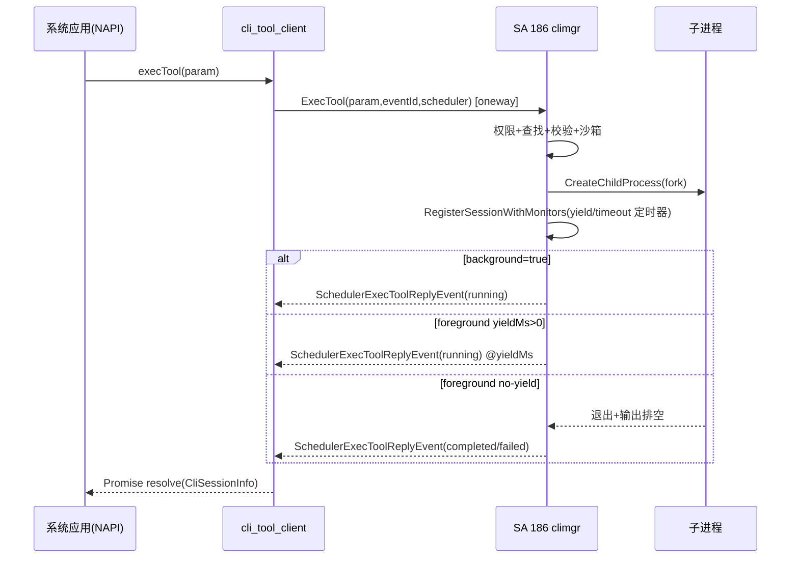
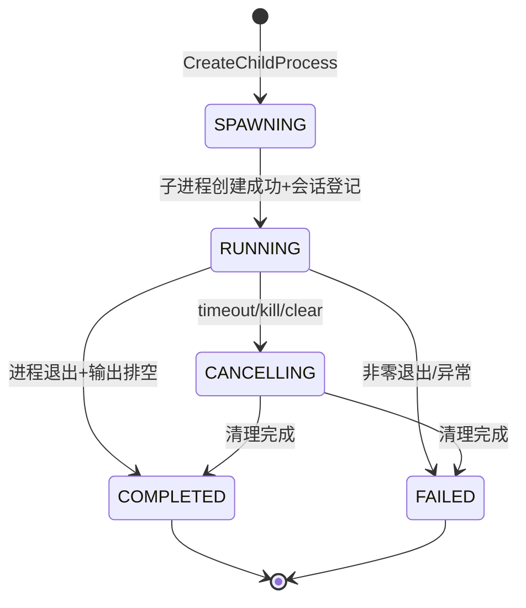
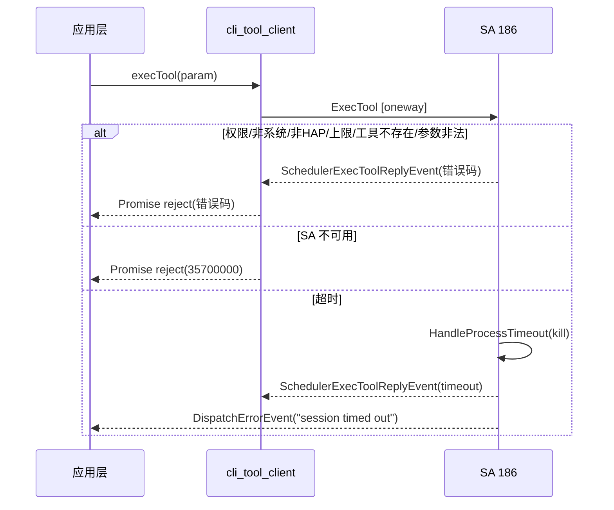

# 架构设计

> 本设计承接 `proposal.md`（条件通过）与 `spec.md`（Draft），固化 `execTool` 的架构约束、关键设计决策与模块影响。设计 AC ⊆ spec AC，不发明新行为。

## 设计元数据

| 字段 | 内容 |
|------|-----|
| Design ID | DESIGN-CLI-001 |
| 关联需求 | `proposal.md`（REQ-010） |
| 关联 Epic | 无（独立特性） |
| 目标 Feature | FEAT-CLI-001 |
| 复杂度 | 标准 |
| 目标版本 | OpenHarmony-6.0-Release（待确认） |
| Owner | 待确认 |
| 状态 | Draft |

## 需求基线

> 需求基线详见 proposal.md。以下仅列出设计阶段需额外强调的要点。

| 项 | 补充说明 |
|----|----------|
| 仅系统应用 + EXEC_CLI_TOOL | 安全边界由 SA 186 入口统一执行，不在 NAPI 层做权限判定 |
| HAP 沙箱前置 | 沙箱配置由调用方 Token 生成，非 HAP 直接拒绝（35700003） |
| 会话内存态不持久化 | 不涉及 RDB/Preferences，无跨版本数据兼容约束 |

## 上下文和现状

### 涉及仓和模块

| 仓库 | 补充架构说明 |
|------|-------------|
| foundation/ability/ability_runtime | 服务层（services/）与 SDK 层（interfaces/kits/）解耦；cli_tool_framework 自成子系统，经 IDL 生成 IPC Stub/Proxy；服务侧依赖 `services/common` 的权限/日志/事件上报设施 |

### 调用链层级分析

| 层 | 模块 | 职责 | 修改类型 |
|----|------|------|----------|
| NAPI | `frameworks/js/napi/cli_tool_manager` | JS↔C++ 绑定：参数解析、同步校验、Promise/异步回调派发 | 修改（既有实现，固化契约） |
| InnerAPI/IPC | `interfaces/cli_tool`（IDL 生成） | `ICliToolManager` Proxy/Stub、`ICliToolManagerScheduler` 回复回调、Parcelable 数据结构 | 修改（既有实现，固化契约） |
| 服务 | `services/climgr` | SA 186 服务端：权限校验、工具查找、参数/schema 校验、沙箱生成、子进程、会话/超时/让出、IO 监控、事件派发 | 修改（既有实现，固化契约） |
| 服务/公共 | `services/common`、`cli_tool_framework/services/common` | 权限工具、HiSysEvent 上报、HiLog 标签 | 不变（复用） |
| SA 注册 | `services/sa_profile/186.json` | SA 186 注册到 samgr（进程 aimgr，库 libclimgr.z.so，ondemand） | 不变 |

**检查项：**
- [x] 调用链每一层都已覆盖（NAPI→InnerAPI/IPC→服务→SA 注册）
- [x] 每层职责边界清晰，无跨层违规（NAPI 不直接调 services 内部；服务不反向依赖 NAPI）
- [x] 每层修改类型明确

### 适用架构规则

| Rule ID | 适用原因 | 设计结论 | 验证方式 |
|---------|----------|----------|----------|
| OH-ARCH-LAYERING | NAPI→InnerAPI/IPC→服务 三层调用 | 调用方向自上而下；服务不反向依赖 NAPI；框架层不直接引用 services 内部头文件 | 依赖检查/代码评审 |
| OH-ARCH-SUBSYSTEM | 单子系统 ability 内闭环 | 不跨子系统调用 | 代码评审 |
| OH-ARCH-IPC-SAF | 跨进程经 SA 186 | oneway `ExecTool` + `SchedulerExecToolReplyEvent` 回复；客户端按需拉起 SA | 集成测试 |
| OH-ARCH-API-LEVEL | 新增 System API | System 级、需 `ohos.permission.EXEC_CLI_TOOL`、系统应用限定 | API 评审/XTS |
| OH-ARCH-COMPONENT-BUILD | 复用既有 component/parts | 无新增 component；BUILD.gn 无新增源文件（既有实现固化） | 构建验证 |
| OH-ARCH-ERROR-LOG | 错误码/HiSysEvent | 错误码 357000xx 区间；失败路径上报 bundleName/toolName/failureReason | 单测/hilog/hisysevent |

## 不涉及项承接

| 维度 | 设计结论 |
|------|----------|
| 安全与权限 | 入口在 SA 做「系统应用 + EXEC_CLI_TOOL」双校验；沙箱由调用方 Token 生成，非 HAP 拒绝；失败经 HiSysEvent 上报。详见「安全基础检查」 |
| API/SDK | 新增 System API `execTool`；签名/d.ts/权限见「API 签名、Kit 与权限」 |
| IPC/跨进程 | oneway IPC + Scheduler 回复；客户端 Scheduler Stub 接收回复并派发到 NAPI 异步任务。详见「时序设计」「线程与并发模型」 |

## 关键设计决策

| 决策 ID | 问题 | 推荐方案 | 探索过的替代方案 | 取舍理由 | 影响 |
|---------|------|----------|-----------------|------|------|
| ADR-1 | 执行承载位置 | SA 186（aimgr）集中承载 | 备选1：应用进程内 fork+exec（放弃，绕过权限/沙箱/审计）；备选2：独立 SA（放弃，复用 aimgr 进程更内聚） | CLI 执行涉及权限/沙箱/超时/审计，集中到 SA 统一安全边界与并发控制 | 服务端实现集中在 climgr |
| ADR-2 | 调用回复模型 | oneway `ExecTool` + `SchedulerExecToolReplyEvent` 异步回复 | 备选1：同步 IPC 返回（放弃，子进程执行可能超 timeout，同步阻塞 Binder）；备选2：客户端轮询 QuerySession（放弃，延迟与功耗差） | 子进程执行时长不定（最长 1800s），同步 IPC 不可行；oneway+回调让回复时机由服务端决定 | IPC 接口为 oneway；客户端须建 Scheduler Stub |
| ADR-3 | 前台长任务返回时机 | yieldMs 让出：定时器到点切后台并派发 reply | 备选1：进程退出才返回（放弃，长任务让调用方长时间无响应）；备选2：长轮询（放弃，功耗高） | yield 让调用方在 yieldMs 处拿到 running 会话后可订阅事件，兼顾响应性与长任务 | 引入 yieldMs 参数与 yield 定时器 |
| ADR-4 | 超时实现 | ffrt 延时任务（`PostExecToolTask`） | 备选1：独立 watchdog 线程（放弃，ffrt 已提供延时能力更轻量）；备选2：alarm 信号（放弃，精度与可组合性差） | 复用 ffrt 延时任务，与既有调度一致 | 超时/让出各一个延时任务 |
| ADR-5 | 并发控制 | 全局会话表 + 系统配置上限 | 备选1：按调用方限流（放弃，全局资源更需保护）；备选2：无上限（放弃，易资源耗尽） | CLI 子进程消耗系统资源，需全局上限保护 | `ValidateSessionLimit` 在入口校验 |

## 设计骨架

### 骨架范围

| 骨架项 | 目标 | 不包含 | 验证方式 |
|--------|------|--------|----------|
| API/接口骨架 | `execTool` 签名、ExecOptions/CliSessionInfo/ExecResult 数据模型 | 完整业务逻辑 | 编译 + API 快照 |
| 模块骨架 | NAPI 入口、IDL 接口、climgr 服务类 | 复杂策略调优 | 构建通过 |
| 测试骨架 | exec_tool_param/exec_options/cli_session_info/process_manager 测试 fixture | 全场景 | 最小用例通过 |

### 骨架 Spec 拆分

| Task ID | 目标 | 受影响文件 | AC |
|---------|------|------------|-----|
| TASK-SKELETON-1 | 建立接口/数据结构骨架 | `interfaces/cli_tool/` | WHEN 编译 THEN IDL/Parcelable 生成通过 |

## 后续 Task 拆分

| Task ID | 目标 | 受影响文件 | 依赖 |
|---------|------|------------|------|
| TASK-CLI-001 | 正常执行链路（权限→查找→校验→沙箱→子进程→会话→回复） | `services/climgr/src/cli_tool_manager_service.cpp` 等 | design + spec Approved |
| TASK-CLI-002 | 会话语义（前台/让出/后台）reply 时机 | `cli_tool_manager_service.cpp`、`session_record.cpp` | TASK-CLI-001 |
| TASK-CLI-003 | 超时/让出定时器与终态派发 | `cli_tool_manager_service.cpp`、`process_manager.cpp` | TASK-CLI-002 |
| TASK-CLI-004 | 权限/非 HAP/SA 不可用异常路径 | `cli_tool_manager_service.cpp`、`cli_tool_mgr_client.cpp` | TASK-CLI-001 |
| TASK-CLI-005 | 参数/schema/超时边界校验 | `tool_util.cpp`、`exec_options.cpp` | TASK-CLI-001 |
| TASK-CLI-006 | NAPI 参数同步校验 | `js_cli_manager.cpp` | TASK-CLI-001 |
| TASK-CLI-007 | 会话上限与并发保护 | `cli_tool_manager_service.cpp` | TASK-CLI-001 |
| TASK-CLI-008 | DFX/HiSysEvent 失败上报 | `cli_event_report` | TASK-CLI-004 |

## API 签名、Kit 与权限

### 新增 API

| API 签名 | 类型 | Kit | d.ts 位置 | 权限要求 | SysCap |
|----------|------|-----|-----------|----------|--------|
| `execTool(toolName: string, subcommand: string, args: object, challenge: string, options?: ExecOptions): Promise<CliSessionInfo>` | System | CliToolKit | `cli_tool_framework/interfaces/.../*.d.ts`（待确认） | `ohos.permission.EXEC_CLI_TOOL` + 系统应用 | 待确认 |

### 变更/废弃 API

无。

## 构建系统影响

### BUILD.gn 变更

```
文件路径: cli_tool_framework/interfaces/cli_tool/BUILD.gn
变更说明: 无新增源文件；IDL 接口与 cli_tool_client 库既有，固化契约不改构建。
```
```
文件路径: cli_tool_framework/services/climgr/BUILD.gn
变更说明: 无新增源文件；climgr SA 库既有，固化契约不改构建。
```
```
文件路径: cli_tool_framework/frameworks/js/napi/cli_tool_manager/BUILD.gn
变更说明: 无新增源文件；NAPI 模块既有，固化契约不改构建。
```

### bundle.json 变更

无新增 component；复用既有 `ability_runtime` part。若 `ohos.permission.EXEC_CLI_TOOL` 尚未在权限定义仓声明，需在该仓补登记（不在本仓）。

---

## 可选设计扩展

### 架构图

```
[系统应用/NAPI execTool] → [cli_tool_client Proxy] →(IPC oneway)→ [SA 186 climgr ExecTool]
  ↑ SchedulerExecToolReplyEvent 回复                                      ↓
  └── [NapiAsyncTask Resolve/Reject] ← [cli_tool_mgr_scheduler_recipient]    [ProcessManager 创建沙箱子进程]
                                                                              ↓
                                                       [IOMonitor 监控 stdout/stderr/stdin]
                                                                              ↓
                                                       [EventDispatcher 派发 IO/Exit/Error 事件]
```

### 数据流/控制流

| 步骤 | 调用方 | 被调用方 | 数据/接口 | 说明 |
|------|--------|----------|-----------|------|
| 1 | NAPI | cli_tool_client | `ExecTool(param, callback)` | 解析参数建 ExecToolParam |
| 2 | cli_tool_client | SA 186 | `ICliToolManager::ExecTool`（oneway） | 拉起 SA（按需）并 IPC |
| 3 | SA 186 | PermissionUtil | VerifyAccessToken | 系统应用 + EXEC_CLI_TOOL |
| 4 | SA 186 | CliToolDataManager | GetToolByName | 工具查找 |
| 5 | SA 186 | ToolUtil | ValidateProperties/GenerateSandboxConfig | schema 校验 + 沙箱 |
| 6 | SA 186 | ProcessManager | CreateChildProcess | fork 沙箱子进程 |
| 7 | SA 186 | IOMonitor | RegisterSession | 监控管道 + 调度 yield/timeout 定时器 |
| 8 | SA 186 | EventDispatcher | DispatchExecToolReplyEvent | 经 Scheduler 回复 |
| 9 | cli_tool_client | NapiAsyncTask | Resolve/Reject | 派发到 JS Promise |

### 时序设计



### 算法与状态机



> CliSessionInfo.status 字符串映射：RUNNING→"running"、COMPLETED→"completed"、FAILED→"failed"。

### 测试性设计

| 测试层级 | 测试目标 | Mock 策略 | 验证方式 |
|----------|----------|-----------|----------|
| 单元测试 | Parcelable 编解码、参数/schema 校验、超时边界 | Mock 服务端 | `exec_tool_param_test`/`exec_options_test`/`tool_util_test` |
| 单元测试 | 客户端错误码与回复派发 | Mock `ICliToolManager`/`Scheduler` | `cli_tool_mgr_client_test`/`cli_tool_mgr_scheduler_recipient_test` |
| 集成测试 | 正常执行链路、会话语义、超时/让出 | 真实 SA + 测试工具 | `process_manager_test`/`cli_tool_mgr_service_test` |
| 集成测试 | 子进程创建与管道 | 真实 fork | `process_manager_test` |

### 异常传播时序图



| 异常场景 | 触发层 | 传播路径 | 最终处理 |
|----------|--------|----------|----------|
| 非系统应用/缺权限 | SA 入口 | SA→Scheduler→NAPI | reject 35700008/35700007 |
| 非 HAP | SA 沙箱生成 | SA→Scheduler→NAPI | reject 35700003 |
| 工具/子命令不存在 | SA 查找 | SA→Scheduler→NAPI | reject 35700005 |
| schema/参数非法 | SA 校验 | SA→Scheduler→NAPI | reject 35700002 |
| 会话上限 | SA 入口 | SA→Scheduler→NAPI | reject 35700001 |
| 超时 | SA 定时器 | SA kill→Scheduler→NAPI + ErrorEvent | reject/终态 + 错误事件 |
| SA 不可用 | 客户端 | cli_tool_client→NAPI | reject 35700000 |

### 资源所有权矩阵

| 资源 | 创建方 | 持有方 | 销毁触发 | 实际释放 | 异常回收 |
|------|--------|--------|----------|----------|----------|
| 子进程 | ProcessManager | SessionRecord | 进程退出/超时/clear | Killpg + reap | 超时定时器 kill |
| 管道 fd(stdin/stdout/stderr) | ProcessManager | SessionRecord | 输出排空/会话清理 | close | IOMonitor 注销 + close |
| 会话记录 | SA | sessions_ 表 | 终态派发后 | RemoveSessionRecord | 超时/清理路径兜底移除 |
| Scheduler Stub | cli_tool_client | client 单例 | DeathRecipient | ClearProxy | 进程死亡清代理 |
| yield/timeout 定时器 | SA(IOMonitor 注册) | ffrt | 触发或会话清理 | ffrt 任务完成 | 会话清理时不取消（幂等检查 record 存在性） |

### 接口参数规约

| 接口 | 参数 | 类型 | 合法范围 | 非法处理 | 边界说明 |
|------|------|------|----------|----------|----------|
| execTool | toolName | string | 非空 + 已注册 | 空/非串→同步抛错；未注册→reject 35700005 | — |
| execTool | subcommand | string | 可空串 + 工具子命令表内 | 非空但工具无子命令/不在表→reject 35700005 | 空串用工具顶层 inputSchema |
| execTool | args | object | 键须在 inputSchema.properties 内且类型匹配 | 含未声明键/类型不符→reject 35700002 | 空对象合法；`help` 须单独存在 |
| execTool | challenge | string | 非空 | 空/非串→同步抛错 | — |
| ExecOptions | background | boolean | true/false | — | 默认 false |
| ExecOptions | yieldMs | int64 | ≥0；非后台须 ≤ timeout*1000 | <0 或越界→reject 35700002 | 默认 0；仅前台生效 |
| ExecOptions | timeout | int64 | ∈[0,1800] 秒 | <0 或 >1800→reject 35700002 | 默认 0=不启用；timeoutMs=timeout*1000 |

### 线程与并发模型

| 操作 | 发起线程 | 回调线程 | 跨进程边界 | 线程安全 | 重入约束 |
|------|----------|----------|------------|----------|----------|
| execTool(NAPI) | JS 主线程 | NapiAsyncTask（JsCliEventHandlerManager 投递） | 是（IPC） | NAPI 异步任务串行化 | 允许并发调用 |
| SA ExecTool | Binder 线程 | ffrt 定时器线程 | 是 | sessions_ 表 ffrt::mutex 保护 | 允许并发会话 |
| IOMonitor 回调 | IOMonitor 线程 | 同 | 否（进程内） | SessionRecord 原子状态 + mutex | 幂等：record 不存在即跳过 |

**并发场景：**

| 场景 | 竞争对象 | 保护机制 | 预期行为 |
|------|----------|----------|----------|
| 多调用方并发创建会话 | sessions_ 表 | sessionsMutex_ 互斥 + 上限校验 | 超限拒绝 35700001 |
| 超时与正常退出竞争 | SessionRecord 状态 | 原子状态 + BeginCleanup 单次进入 | 仅一方完成终态派发 |
| 回调与代理死亡竞争 | Scheduler 代理 | DeathRecipient + mutex | 代理死亡不清会话，仅清代理 |

### 安全基础检查

> proposal「安全与权限」= 是，本节必填。

#### 信任边界交叉分析

| 边界类型 | 跨越的交互 | 风险 | 约束 |
|---|---|---|---|
| 用户态/内核态 | fork 子进程、pipe 读写 | 子进程越权 | 子进程运行在调用方 HAP 沙箱；SA 持 caps=KILL 可终止 |
| 沙箱内外 | 子进程 vs SA(aimgr) 进程 | 跨沙箱数据泄漏 | 沙箱配置按调用方 Token 生成；stdin/stdout/stderr 经管道受控 |
| 本地/远程 | NAPI→IPC→SA 全本地 | 无远程暴露 | 仅本机系统应用可调 |
| 不同 SELinux 域 | aimgr 域 vs 子进程域 | 域切换 | SA 域 aimgr；子进程域由沙箱配置决定 |

#### 基础安全要求

| 检查项 | 结论 | 说明/措施 |
|---|---|---|
| 加密算法(OH 推荐) | N/A | execTool 不涉及加密 |
| 密钥管理 | N/A | 不涉及密钥 |
| 随机数 | sessionId 生成 | 由 ToolUtil::GenerateCliSessionId 生成，不要求密码学随机 |
| 输入验证 | 强制 | toolName/subcommand/schema/timeout/yieldMs 全链路校验，非法即拒绝 |
| 错误处理 | 错误码化 | 357000xx 区间，不泄漏内部栈 |
| 配置 | 系统配置 | 并发上限由系统配置，非调用方可控 |
| 敏感数据处理(传输/存储/日志) | 不存储敏感数据 | 会话内存态；日志不打印 args 明文（args 仅 Key 校验） |

### 深度威胁分析(如需)

> 命中高风险判据评估：execTool 涉及沙箱/子进程/权限，但无网络暴露、无认证授权（仅本机系统应用+权限）、无敏感数据存储、无合规强约束。判定为不升级独立 threat-model.md。如 Owner 复核认为子进程沙箱逃逸风险需深入，再由 `ohos-security-threat-model` 产出。

## 风险和开放问题

| 项 | 类型 | 影响 | 处理方式 | Owner |
|----|------|------|----------|-------|
| 目标版本/Owner 未确认 | 进度 | 基线无法冻结为「通过」 | 需求方/SIG 确认 | 待确认 |
| d.ts 位置/SysCap 未确认 | API | 影响 @since 与 SysCap 声明 | API 评审 | 待确认 |
| `ohos.permission.EXEC_CLI_TOOL` 权限登记仓 | 构建 | 权限须在定义仓声明 | 跨仓协调 | 待确认 |
| yield/timeout 定时器在会话清理后触发 | 可靠性 | 幂等检查 record 存在性，已缓解 | 代码评审 + 单测 | — |

## 设计审批

- [x] 需求基线已确认，设计覆盖 P0/P1 AC（AC-1.1–1.15）
- [x] 不涉及项已承接，N/A 和展开项都有结论
- [x] 涉及仓和模块职责清楚
- [x] 调用链层级分析完整，每层覆盖到位
- [x] 适用架构规则已识别并形成设计结论
- [x] 分层和子系统边界合规
- [x] API 变更有签名、权限、错误码和兼容性说明
- [x] BUILD.gn/bundle.json 影响明确（无新增源文件，固化契约）
- [x] 设计输出和后续 Task 拆分明确
- [x] 关键设计决策有理由和影响说明
- [x] 风险和开放问题有 Owner（部分待确认）

**结论:** 条件通过（待 Owner 复核后转「通过」）
